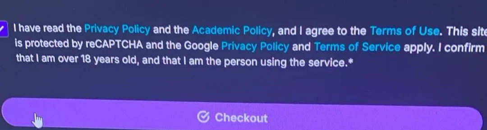
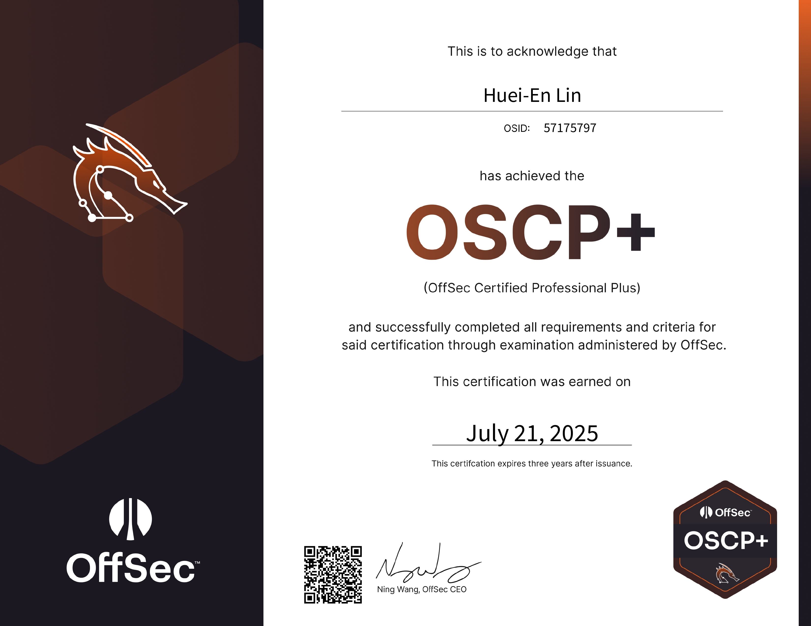

第一次遇到心得被催更的，結果我在 AIS3 Club 飯店裡打這篇心得 ~~結果最後還是拖了好幾周才上傳就是了~~

# Where the Story Begins

前情提要：那時候是 12 月底，我打完金盾、創了 TYSHCTF，想說是時候來挑戰一下證照了…

某天，在我跟 Jackoha 跑去桃園 **白喵一番屋** 打 mai 的時候…

---

Grissia: 誒 考到 OSCP 感覺就很強誒，要不要衝一波

Jackoha: …(想了兩秒)走啊

---

然後我那天晚上大概八點多回到家，九點就說服我媽刷卡了

---

Grissia: 我買了，你呢

Jackoha: ？？？

Grissia: f…

# Get Your OSCP as a Minor

## Standard Protocol

據 Jackoha 跟網路文章所言，正確的購買流程如下：

1. 先跟他表示自己是未成年人，想要買課程
2. 他會跟你確認監護人同意書、監護人證件、你的證件
3. Offsec 會指派一個 Account Manager 來跟你視訊，主要也是確認家長同意
4. 付款後成功拿到 Offsec 帳戶

其他詳情也可以參考 https://medium.com/@allypetitt/how-i-got-my-oscp-at-16-years-old-50ed402d6fd1

## My Experience

Offsec 對於未成年人直接購買的處理程序：

1. 當他知道你未成年，他會立刻停掉你的 Offsec 帳戶
2. 接著要求你提供各種相關訊息像是監護人證件、監護人同意書、各種確認

這可能是我高中生活中最緊張的一週，因為我花了一週去跟 Offsec 官方反覆確認我的身份

還要確認我的父母真的同意我參與這個課程

(他應該是怕我爸媽不知道我有上，然後到時候來告他們「教壞小孩」之類的)

我們郵件一來一往大概要花一天，中間他可能感受到我有點不耐煩，所以又拖了一下

一週後我才成功拿回我的帳號，非常感動，大家千萬要記得看完再點同意

# Course Materials

關於 OSCP (pen-200) 本身的考試規則跟內容我就不多加贅述了

有需要的可以參考 Offsec 官方的 https://help.offsec.com/hc/en-us/articles/360040165632-OSCP-Exam-Guide

不過因為現在新的考試制度一直有在更新

最近也在教材中加入了 Cloud Security 跟偏向 Social Engineering 的教學 (目前都未納入考試)

所以蠻常更新的，報名、考試前最好先去看看

## Exam Topics

關於我學課程的經驗，總體來說我覺得這是一個「偏向實作的新手向證照」

先不論網路上超高的失敗率，他裡面教的 web 大概也就是 picoCTF medium 等級

主要是比較偏向實務，解題思路上可能會跟 CTF 不太一樣

但是他的教材還是蠻循序漸進的，基本上只要打過幾個月 CTF 應該都可以取得所需的先備知識

所以其實沒有原先想像的那麼可怕，我區區一介普通高二生慢慢翻個一學期就差不多可以考試了

---

我自己學起來最費勁的應該是 tunneling 跟 Kerberos，需要花時間理解它的原理跟流程

不過我 lab 最多打不出來的還是 Privilege Escalation，如果沒有做好 enumeration 很容易錯過關鍵

## pen-200 Labs

除了課程教材本身，他的 Lab 才是整個 pen-200 的精華

每個章節會不定期出現比較困難的 Capstone Lab

可以說是很大程度的開拓我的眼界，讓我在做題的時候可以考慮的更周全，不會被侷限於典型的題目

另一個重點是課程看完後可以嘗試的 Challenge Lab

雖然一共只有十個，不過前面 0-3 題都超多，大概一題要做一個禮拜 (白天去學校 晚上 OSCP)

如果目標只是要考到證照的話，我會推薦把 Challenge 0-2、ABC 做完

接著參考 https://docs.google.com/spreadsheets/d/18weuz_Eeynr6sXFQ87Cd5F0slOj9Z6rt/htmlview 去做 PG practice

因為 PG Practice 的題目相較於 HTB 或 THM 比較偏向考試，可以感受到 Offsec 團隊的風格

而且如果你也是一樣買 Learn One 的話 PG Practice 是附贈的，不用額外付錢

所以其實我到考前 HTB 都沒做幾題，PG 大概做了 15 題左右

(鄭. 太狠了，到底怎麼做到 150 多題 PG 的，電爛我了)

# The OSCP Exam

再說一次，考試相關規定請參考 [OSCP Exam Guide](https://help.offsec.com/hc/en-us/articles/360040165632-OSCP-Exam-Guide)

~~他擺明了就是想留著最終解釋權，我試過寫信問他 builtin AI 工具使用的問題，他叫我自己判斷會不會違反規則~~

這邊講一些網路上比較難查到的經驗

## Computer Check

我本來以為他會叫我跑奇怪的執行檔或是安裝什麼軟體

結果他只是給我一堆 PS Script 叫我跑完把結果複製給他

內容大概就是看看我有裝哪些軟體、現在在跑哪些 process 這類的

## VPN Pack

VPN Pack 會在考試開始，監考官核對完身份、檢查完電腦環境後才給你

接著他會確認你有連上去 (不過其實連上去就可以直接開始打了)

## Proctor

基本上他不怎麼會理你，頂多是考試中共享畫面斷掉會提醒你重連

比較特別的是可以考生端可以看到他們的暱稱

所以當我看到同一個人又出現的時候就知道他們輪班一輪了 ~~也代表我快連續爆肝 24 小時了~~

## Exam itself

我安排的考試是星期六早上十點開始 (而且我星期一開始上暑輔，差點睡死)

**切記，要提早 15 分鐘進到監考系統**，考官確認完環境大概是 10:15

下面是我解題的時間軸 (因為 NDA，把機器的名字改成 AD123 跟 Standalone123)

- 10:15 - 11:41 → 拿到 AD01 的 local → 10 pts
- 11:41 - 12:30 → 吃午餐 → 10 pts
- 12:30 - 14:13 → 坐牢，每個都碰了一點但都沒什麼進展
- 14:30 - 15:30 → 午休睡了一小時 → 10 pts
- 15:30 - 17:08 → 拿到 Standalone01 的 local → 20 pts
- 17:08 - 23:23 → 拿到 AD02 的 local → 30 pts
- 23:23 - 23:39 → 十分鐘內打下 AD03 拿到 AD 最後 20 分→ 50 pts
- 23:39 - 2:06 → 拿到 Standalone02 的 local → 60 pts
- 2:06 - 2:10 → 五分鐘內提完 Standalone02 Admin 成功通過考試 → 70 pts
- 2:10 - 7:00 → 回去全部重打寫報告

## Report

Day2 早上七點結束考試，看到外面天亮的時候感覺腦子已經不正常了

- 7:00 - 11:00 → 跟床相親相愛
- 11:00 - 15:00 → 先打個 CS :))))))))))
- 15:00 - 16:00 → 把剩下來的報告寫一寫就交出去了 (我在考試中已經寫差不多了)
- 16:00 - 20:00 → 叫 Jackoha 出來打 mai

我自己是用 https://github.com/noraj/OSCP-Exam-Report-Template-Markdown 來寫報告

他的 Document 寫的蠻完整的，也可以去看 John Hammand 的影片

https://www.youtube.com/watch?v=MQGozZzHUwQ

但是如果你有去看官方的 word 模板會發現他的 ToC 跟 Markdown 的完全不一樣

Markdown 的模板超舊，裡面甚至還有 Buffer Overflow 題目的欄位 (已從考試中移除)

所以我花了一些時間自己修改成接近官方的目次排序，如果有需要可以敲敲我

## PASSED!

我星期日送出了報告之後，7/21/2025 星期一的凌晨就收到 Offsec 的通過通知

接著就可以拿到我美麗的證照

關於證照領取還有件趣事可以分享，就是我在禮拜一就在考試預約的畫面看到恭喜通過的字樣了

但我到現在也不知道他是會提前公布，還是每個考完試的都會先顯示通過

所以 … idk，如果剛考完考試可以去看看？

# Mindset

大概考前一個月，我超級焦慮的，那時候的進度大概是打完 Challenge Lab 0-2

看到後面還有七個 lab 之後嚇到把考試往後推遲了一週

不過後來發現其實來得及，因為已經放暑假了，結果我最後一週都在 PG Practice + CS

但其實考前休息幾天還蠻不錯的 (對我來說)，休息幾天之後感覺心情輕鬆不少，也沒有這麼有壓力

## Try Harder

避免大家不知道，Offsec 的核心理念就是要 Try Harder

在 pen-200 的教材中甚至有一整個章節的~~心靈雞湯~~挑戰自我的心法

雖然話是這麼說，不過在考前幾天我努力做 Lab 的時候才理解所謂 Try Harder 在幹嘛

因爲在解題的過程中其實很常出現努力找幾個小時，結果沒有任何進展的情況

當時又是考試前，我就難免會有「要是這是考試我就完了」的想法

這時候又要再來引用這篇心得文 https://medium.com/@allypetitt/how-i-got-my-oscp-at-16-years-old-50ed402d6fd1

> Channel your inner child and keep asking questions and experimenting with ideas, even if you think it won’t work. Most ideas will probably fail, but all you need is one success.

這句話陪伴我整場考試，每當我遇到錯折、幾個小時白費力氣

我就會告訴自己「我只需要那一次成功」，相信題目是有解的，更重要的：相信自己解得出來

這句話讓我撐過整場考試，也希望可以幫到你

## Thoughts

總之，很高興我通過了考試 ~~這鬼東西我可不想考第二次~~

我要感謝我的父母，雖然其實根本不知道我在幹嘛，但是放心的給我精神、經濟上的支援

感謝 jackoha 這半年來陪我準備考試、相互學習與督促

感謝我自己沒有放棄，撐過了難熬的 24 小時，拿下這張證照

感謝其他所有提供相關幫助的大佬，你們都電爛我了

如果你有 OSCP 相關的問題，我也很樂意幫忙回答，如果有考慮入手這張證照就儘管去試，Try Harder

[退場音樂](https://www.offsec.com/blog/say-try-harder/)